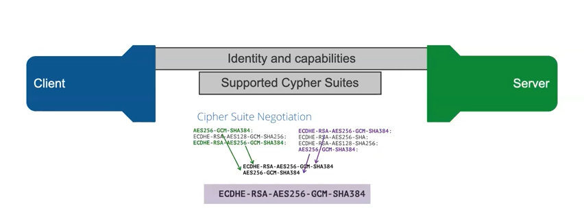
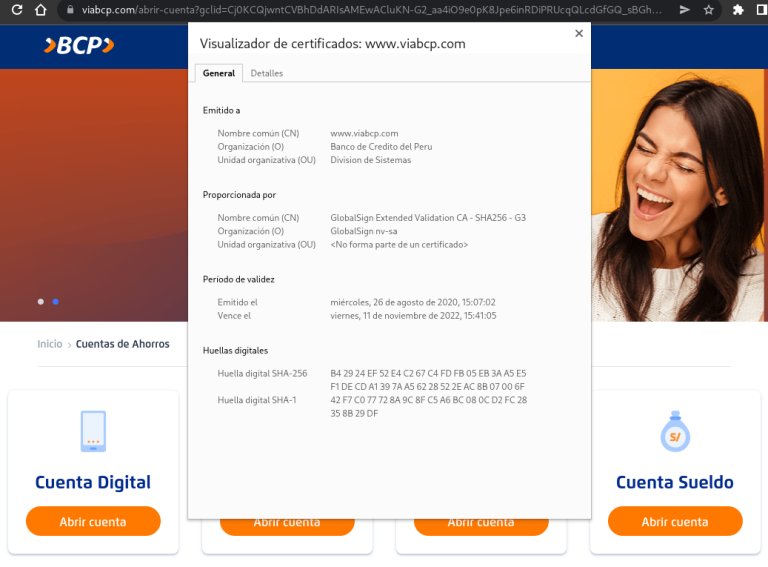

### ¿Que es SSL?

SSL (Secure Socket Layer) es un protocolo que codifica la información que viaja entre tu dispositivo(computadora, tablet, telefono) y un servidor web como por ejemplo la página de un banco. es importante para un usuario que una página web o cualquier servicio cuente con este tipo de protocolo porque así nuestra información de contraseñas, usuarios, mensajes e incluso tarjetas de credito no viaja de manera legible por algun atacante que quiera robar nuestros datos. Si no, en cambio, viaja de manera cifrada e ilegible solo comprensible para el servidor y el cliente.

Ya que comprendemos esto pensaremos que al ver un candadito en la pagina web es 100% seguro enviar cualquier información a travez de esta. 

Pues NO, pensar esto es un error debido a que existen servicios que te permiten generar certificados de encryptacion SSL lo cual es bueno si solo quiere crear una pagina como un blog o para difundir informacion simplemente(Como esta pagina), pero algunas personas maliciosas crean paginas con la intencion de hacerse pasar por instituciones financieras o entidades bancarias y robar tu informacion financiera. 

:::tip Pregunta

¿como identificamos a estos delincuentes ciberneticos?

:::

La manera mas eficaz es verificar la informacion que guarda este certificado para ello utilizaremos como ejemplo al banco BCP (Perú). en la siguiente imagen se podra evidenciar la informacion del certificado.

En la imagen de arriba podemos observar en la pagina viabcp.com que si damos click en el candado y luego en “La conexion es segura” podemos ver un poco de la informacion sobre el certificado en este caso nos dice que el certificado ha sido emitido para “Banco de Credito del Peru [PE]” esta informacion ya nos valida que estamos en la pagina del BCP y no es una creada por delincuentes pero sin embargo seamos mas curiosos y hagamos click en “El certificado emitido es válido”.

Aqui nos brinda aun mas detalles sobre la institucion que solicitu el certificado y quien lo ha emitido, ahora si esto nos brinda la tranquilidad de poder realizar nuestras operaciones en nuestra institucion financiera de preferencia. es recomendable ver siempre que realices operaciones financieras por internet o que vayas a enviar datos confidenciales por la web verificar que la pagina en la que te encuentras es quien dice ser y no una copia realizada para capturar tu información.