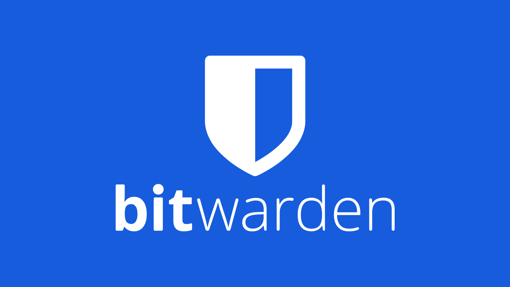
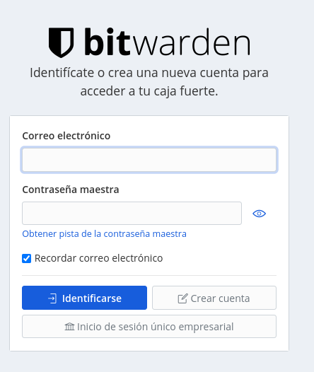

En el creciente mundo de internet es importante que conozcas los riesgos a los que nos enfrentamos cada día. Uno de los mayores riesgos es el de las contraseñas, al ser la mente muy frágil tenemos la costumbre de colocar contraseñas que suelen ser inseguras y fáciles de adivinar para los atacantes por ello es importante que consideremos el uso de Gestores de Contraseñas.

Estos gestores nos permiten colocar contraseñas más complejas sin necesidad de estar memorizando cada una de ellas, solo debemos recordar una ‘Contraseña maestra’ que es la que desbloquea toda la bóveda, por lo general estos servicios son de paga, y los que no por mi parte son considerados poco fiables, pero en este caso ***BitWarden*** es un gestor de contraseñas Open Source que incluso te permite montar tu propio servidor si tienes los conocimientos, además su uso es gratuito a nivel de usuario ya que su modelo de negocio se enfoca a empresas y algunas características adicionales que si deseas usar debes pagarlas.

Ahora, la pregunta: ¿Cómo iniciamos a usar este gestor? Bueno, la respuesta es sencilla, vamos a dirigirnos a <a href="https://vault.bitwarden.com/">vault.bitwarden.com</a> para luego continuar haciendo clic en ‘Crear una Cuenta’.

Te será solicitada información como tu correo, etc para crear tu cuenta. Una vez creada ya podrás guardar la información de tus contraseñas, e incluso te incluye un generador de contraseñas con el que puedes crearlas según la complejidad que desees y almacenarlas ahí.

Ya finalizando lo mejor de este servicio es que tiene una app disponible para Android, IOS, Mac e incluso AddOns para los exploradores más conocidos, lo cual te permite una integración con todos tus dispositivos y tener disponible tu información de manera segura a donde vayas.