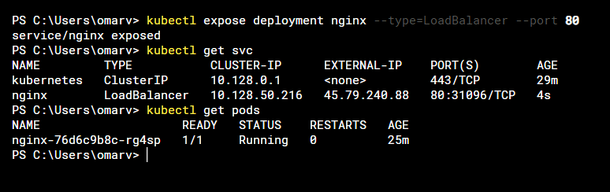

# Desplegando un app en Kubernetes!

Existen varias maneras de desplegar una imagen o containers en kubernetes en este blog veremos algunas de ellas.

### Desplegando con una imagen

```
kubectl create deployment nginx --image nginx
```
Podemos verificar el despliegue que acabamos de realizar
```
kubectl get pods
```
El problema que encontraremos con al desplegar de esta forma es que no disponemos de una manera para hacer llegar tráfico a nuestro pod por ello tendremos que desplegar un servicio que nos permita tener el tráfico de comunicación con el pod
```
kubectl expose deployment nginx --type=LoadBalancer --port 80
```
Con esto se creará un balanceador de carga el cual nos asignara una ip externa en el puerto que hemos indicado



Asi de una manera digamos rustica estara completo del despliegue de nuestra app desde un container

### Desplegando con un manifiesto
