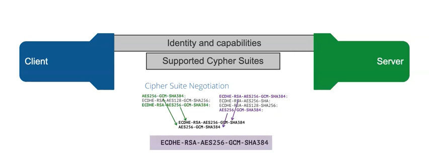
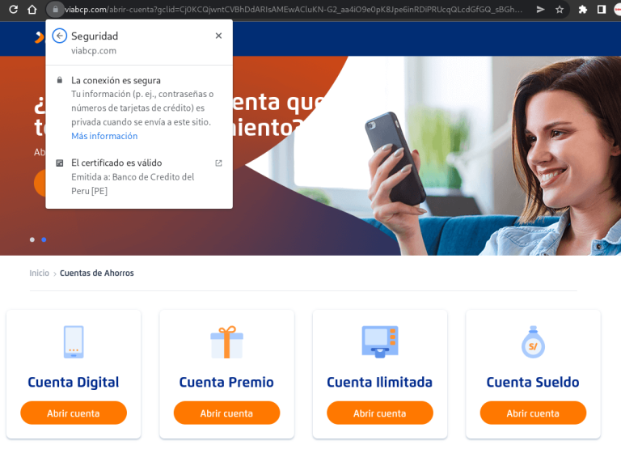

### What is SSL?

SSL (Secure Socket Layer) is a protocol that encrypts the information that travels between your device (computer, tablet, phone) and a web server such as a bank page. It is important for a user that a website or any service has this type of protocol because our password information, users, messages and even credit cards do not travel in a readable way by any attacker who wants to steal our data. Instead, it travels in an encrypted and unreadable way only understandable for the server and the client.

Now that we understand this, we will think that when we see a padlock on the web page it is 100% safe to send any information through it. 

Well NO, to think this is a mistake because there are services that allow you to generate SSL encryption certificates which is good if you just want to create a page as a blog or to spread information simply (like this page), but some malicious people create pages with the intention of impersonating financial institutions or banks and steal your financial information. 

:::tip Pregunta

how do we identify these cybercriminals?

:::

The most effective way is to verify the information that keeps this certificate for it we will use as example to the bank BCP (Peru). in the following image it will be possible to be evidenced the information of the certificate.

In the image above we can see in the viabcp.com page that if we click on the padlock and then on "The connection is secure" we can see some information about the certificate in this case it tells us that the certificate has been issued for "Banco de Credito del Peru [PE]" this information already validates that we are in the BCP page and it is not one created by criminals but nevertheless let's be more curious and click on "The issued certificate is valid".

Here we provide even more details about the institution that requested the certificate and who has issued it, now if this gives us peace of mind to perform our operations in our financial institution of choice. it is advisable to see whenever you perform financial transactions over the internet or you are going to send confidential data over the web to verify that the page you are on is who it claims to be and not a copy made to capture your information.