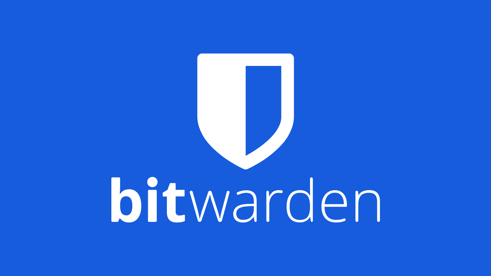
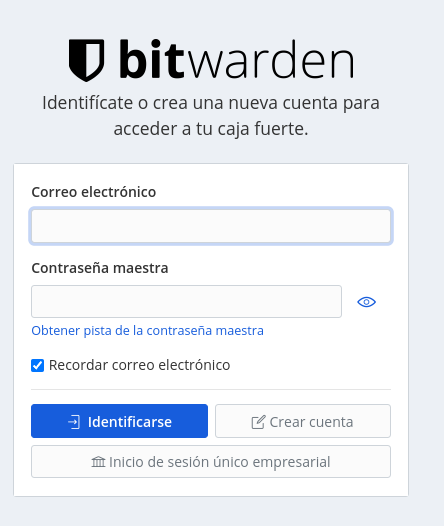

In the growing world of internet it is important that you know the risks we face every day. One of the biggest risks is that of passwords, being the mind very fragile we have the habit of placing passwords that are often insecure and easy to guess for attackers so it is important that we consider the use of Password Managers.

These managers allow us to place more complex passwords without having to memorize each one of them, we only have to remember a 'Master Password' which is the one that unlocks the entire vault, usually these services are paid, and those that are not for my part are considered unreliable, but in this case ***BitWarden*** is an Open Source password manager that even allows you to set up your own server if you have the knowledge, also its use is free at user level since its business model is focused on companies and some additional features that if you want to use you must pay for them.

Ahora, la pregunta: ¿Cómo iniciamos a usar este gestor? Bueno, la respuesta es sencilla, vamos a dirigirnos a <a href="https://vault.bitwarden.com/">vault.bitwarden.com</a> para luego continuar haciendo clic en ‘Crear una Cuenta’.

You will be asked for information such as your email, etc. to create your account. Once created you will be able to save your password information, and it even includes a password generator with which you can create them according to the complexity you want and store them there.

Finally, the best thing about this service is that it has an app available for Android, IOS, Mac and even AddOns for the most popular browsers, which allows you to integrate with all your devices and have your information securely available wherever you go.