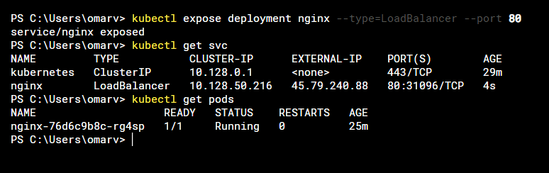

# Deploying an app on Kubernetes!

There are several ways to deploy an image or containers in kubernetes in this blog we will see some of them.

### Deploying with an image

```
kubectl create deployment nginx --image nginx
```
We can verify the deployment we have just performed
```
kubectl get pods
```
The problem we will encounter when deploying in this way is that we do not have a way to get traffic to our pod so we will have to deploy a service that will allow us to have the communication traffic to the pod.
```
kubectl expose deployment nginx --type=LoadBalancer --port 80
```
This will create a load balancer which will assign us an external ip on the port we have indicated.



This way, in a rustic way, the deployment of our app from a container will be complete.

### Deploying with a manifest
